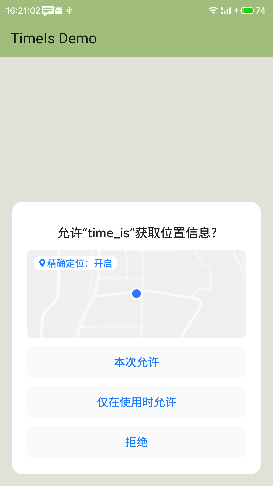
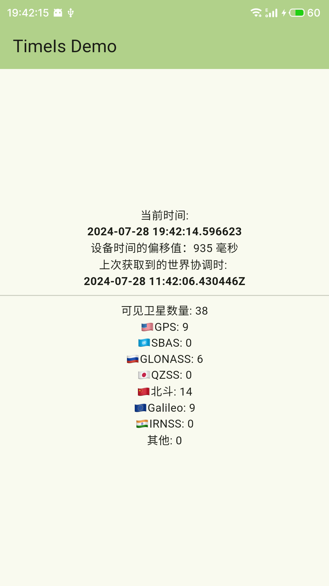

# TimeIs

一个简单的Flutter应用，展示卫星授时的结果。

# 截图

    

## 介绍

**仅支持Android。**

由Flutter编写的一个简单的显示当前时间和日期的应用。时间是从GNSS服务获取，来自于卫星数据。

### 当前时间

实时显示当前时间。

### 上次获取到的世界协调时

来自卫星的数据是不连续的，此处展示的是上次获取的时间转换为世界协调时间的结果。

### ⚠️注意⚠️

坦率地说，这个东西没有什么用，因为它得到的时间在不同设备上总是有**几十毫秒的偏差**，我也不知道为什么。🤣如果你能接收这个级别的误差，我想它是为数不多的能够提供卫星授时的程序。

### TODO

- 提供NTP服务，用于局域网设备的时间同步

### Getting Started

This project is a starting point for a Flutter application.

A few resources to get you started if this is your first Flutter project:

- [Lab: Write your first Flutter app](https://docs.flutter.dev/get-started/codelab)
- [Cookbook: Useful Flutter samples](https://docs.flutter.dev/cookbook)

For help getting started with Flutter development, view the
[online documentation](https://docs.flutter.dev/), which offers tutorials,
samples, guidance on mobile development, and a full API reference.
